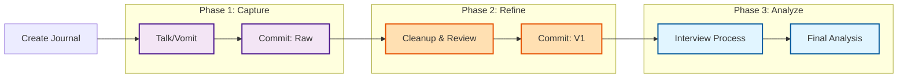

# Journaling Process Overview

## Three-Phase Process

## Phase Details

- **Phase 1 (Capture)**: Raw brain dump using voice → Initial commit
- **Phase 2 (Refine)**: Clean up text, review for clarity → V1 commit
- **Phase 3 (Analyze)**: AI-driven interview, questions, push back → Final analysis
