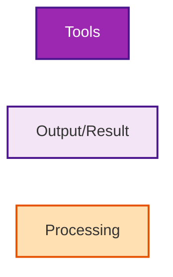
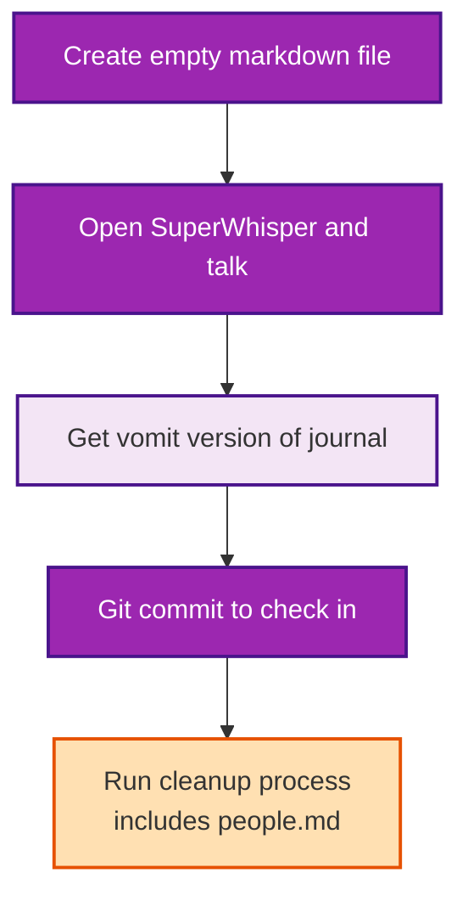

# Journaling Process Flowchart

## Key

```mermaid
graph LR
    A[Tools]:::tools
    B[Output/Result]:::output
    C[Processing]:::processing
    
    classDef tools fill:#9c27b0,stroke:#4a148c,stroke-width:2px,color:#fff
    classDef output fill:#f3e5f5,stroke:#4a148c,stroke-width:2px
    classDef processing fill:#ffe0b2,stroke:#e65100,stroke-width:2px
```

## Process Flow

```mermaid
graph TD
    Start[Create empty markdown file]:::tools
    Whisper[Open SuperWhisper and talk]:::tools
    Vomit[Get vomit version of journal]:::output
    Commit[Git commit to check in]:::tools
    Cleanup[Run cleanup process<br/>includes people.md]:::processing
    
    Start --> Whisper
    Whisper --> Vomit
    Vomit --> Commit
    Commit --> Cleanup
    
    classDef tools fill:#9c27b0,stroke:#4a148c,stroke-width:2px,color:#fff
    classDef output fill:#f3e5f5,stroke:#4a148c,stroke-width:2px
    classDef processing fill:#ffe0b2,stroke:#e65100,stroke-width:2px
```
